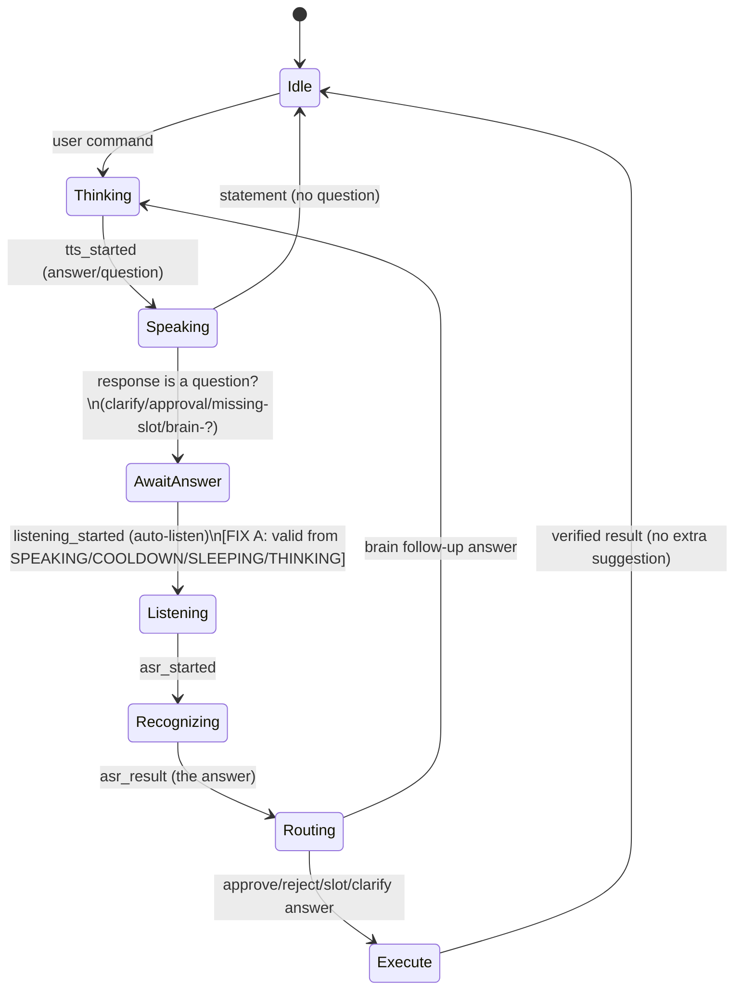

# Dynamic Interaction Trigger Design — "ask → listen → recognize → route"

> Goal: when Nexi asks a question (clarify / approval / missing-slot / plan follow-up), it must
> **automatically re-arm listening**, capture the user's reply, and route it to the correct
> decision branch — so the user is never left hanging — *without* emitting extra suggestions
> once the requirement is satisfied.

## 0. What the log proved

| Evidence in log | Meaning |
|---|---|
| `close this` → `[CLARIFY] question=…` → `[TURN] auto_listen requested reason=clarification` | The re-listen intent **exists** for clarify. |
| `[VOICE_STATE] transition_failed reason=no_valid_transition event=listening_started current=speaking` | **BUG:** the state machine rejected `listening_started` while SPEAKING → mic doesn't re-arm. |
| `click the submit button` → `[APPROVAL] queued act1` → spoke "say approve…" → (no auto_listen) | **GAP:** approval prompts didn't re-arm listening (text wasn't a question). |
| `approve` (typed) → executed act1 | The answer routes correctly once received — only the *listening trigger* was missing. |

## 1. Trigger Overview

| # | "Needs-input" pattern | Detected by | Trigger | Answer routes to |
|---|---|---|---|---|
| T1 | **Clarify** ("close this" → "which one?") | router `route=clarify` / `clarification_question` | `mark_waiting_for_user` + `set_pending_followup` + auto-listen | re-submitted as the clarify answer |
| T2 | **Approval** ("click submit" → "approve or reject?") | tool result `requires_approval` + `expects_user_reply` | same auto-listen path | `approve_action` / `reject_action` |
| T3 | **Missing slot** ("open the settings page" → "which page?") | tool result `expects_user_reply` + `missing_slot` | same auto-listen path | re-run tool with the slot filled |
| T4 | **Plan / brain follow-up** ("help me plan…" → "what type?") | response text ends with `?` (`response_asks_question`) | same auto-listen path | next `brain` turn |

All four converge on **one** mechanism — there is no per-question duplicate logic (constraint:
"do not duplicate logic"). The single trigger is: *assistant response is a question →
`mark_waiting_for_user` + `should_auto_listen()` → re-arm mic → capture → re-submit*.

## 2. Flow Specification (Mermaid)



## 3. Pseudo-code (canonical "ask_user" trigger — already in `command.ask_user`)

```python
def ask_user(question, reason, workflow_id=None):
    mark_waiting_for_user(question, reason, workflow_id)      # turn_manager: should_auto_listen()=True
    set_pending_followup(question, infer_followup_type(question), reason)  # followup_manager
    speak(question, handler_reason=reason)                    # TTS asks it
    _maybe_start_auto_followup()                              # re-arm + capture (voice sources)

def _maybe_start_auto_followup():
    if not should_auto_listen(): return
    if current_source() not in {hotword,clap,hotkey,ui_button,mic_button,voice}: return  # typed = no mic
    consume_auto_listen_request()
    set_ui_state("listening", source=reason)   # -> voice_state_machine: listening_started  [FIX A makes this valid]
    query = takecommand()                       # capture the spoken answer
    if query: submit_user_command(query, source, mode="voice")  # routes the answer normally
```

The detection that fires the trigger (already present, `assistant_response.response_asks_question`):

```python
def response_asks_question(text):
    return text.endswith("?") or text.startswith(QUESTION_STARTS) or any(p in text for p in QUESTION_PHRASES)
```

## 4. What was implemented this session (clean files only)

- **FIX A — state machine re-arm** (`engine/voice_state_machine.py`): `listening_started` is now a
  valid transition to `LISTENING` from `SPEAKING`, `COOLDOWN`, `SLEEPING`, and `THINKING`. This
  removes `transition_failed reason=no_valid_transition event=listening_started` and lets the mic
  actually engage after a question. Tests: `test_voice_state_asr_idempotent.py`.
- **FIX B — approval prompts are now questions** (`engine/approval_queue.py` `gate()`): the prompt is
  `"… needs your approval — risk critical. Approve or reject?"` and the result carries
  `expects_user_reply=True` + `clarification_question`. Because it ends with `?`,
  `response_asks_question` is True, so the **existing T1/T4 auto-listen path fires for approvals**
  (T2) — no new/duplicate logic. Tests: `test_approval_queue.py`.

T3 (missing-slot, e.g. `request_feature` "What capability…?", `open_settings_page` "Which page?") and
T4 (brain "?") already end with `?`, so they already trigger the path once FIX A lets the mic re-arm.

## 5. Example Walkthrough — "help me plan agent example"

```
User (voice): "help me plan an agent example"
  -> route=brain  (long/planning -> brain)         # already fixed earlier
Nexi: "Sure — what type of agent example: a tool-using agent, a workflow, or a monitor?"   (ends with ?)
  -> response_asks_question = True
  -> mark_waiting_for_user(reason="assistant_question"); set_pending_followup(...)
  -> _maybe_start_auto_followup(): source=voice -> set_ui_state("listening")
       -> voice_state_machine: SPEAKING --listening_started--> LISTENING   [FIX A: no transition_failed]
  -> takecommand() captures: "a workflow"
User: "a workflow"
  -> submit_user_command("a workflow", source=voice)  # routed as the answer to the pending follow-up
Nexi: gives the workflow plan.   (statement, not a question -> NO further auto-listen, NO extra suggestion)
```
No redundant suggestion is emitted because the final answer is a **statement** (not a question), so
`response_asks_question=False` → the trigger does not re-fire → conversation returns to Idle.

## 6. Validation Checklist

- [x] `listening_started` re-arms from SPEAKING/COOLDOWN/SLEEPING/THINKING (no `transition_failed`).
      → `test_listening_started_rearms_after_question_while_speaking`, `…_from_sleeping_and_thinking`
- [x] Approval prompt is a question (`endswith('?')`) and sets `expects_user_reply`.
      → `test_gate_prompt_is_a_question_and_expects_reply`
- [x] Approval answer routes correctly: `approve` → `approve_action` → executes; `reject` → removed.
      → `test_approve_action_tool_executes_oldest`, `test_reject_action_tool`
- [x] Critical actions still require approval before acting (trigger doesn't bypass the gate).
      → `test_critical_actions_require_approval`
- [x] A statement answer does NOT re-fire the trigger (no extra suggestion) — by construction
      (`response_asks_question=False`).
- [ ] **Deferred (needs foreign `command.py`):** route tool results carrying `requires_approval` /
      `expects_user_reply` through `ask_user()` so approval auto-listen is guaranteed even on the
      tool-result path (T2 end-to-end on voice). `command.py` is part of the uncommitted
      `src/orin→engine` refactor; apply once it's committed/stashed. The hook is one call:
      in the tool-result branch, `if tool_result.get("expects_user_reply"): ask_user(tool_result["message"], reason="approval")`.

## 7. No leftover artifacts

All validation runs via the permanent pytest suites above (no temp scripts/mock files written to
the repo). No Chrome or app windows are opened by these tests.
